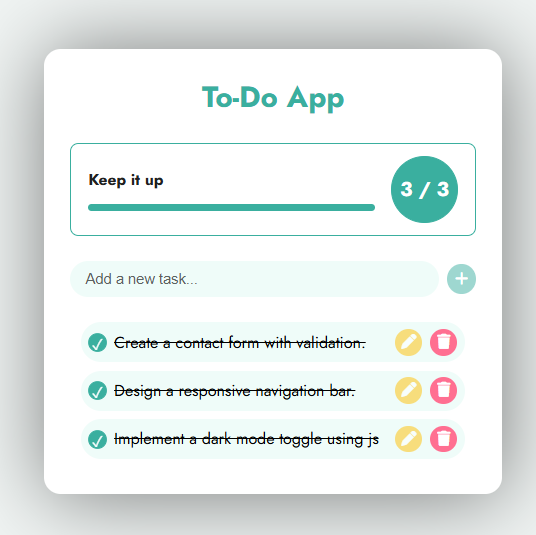
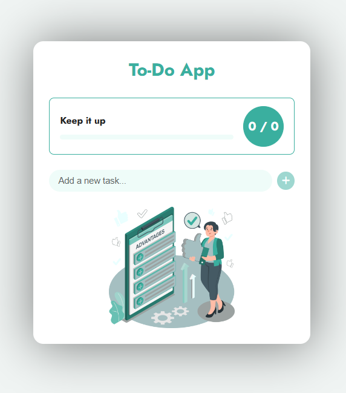

# ✅ To-Do List App with Progress Tracker & Confetti 🎉

A responsive and interactive To-Do List app built with **HTML**, **CSS**, and **JavaScript**.  
Features live progress tracking and a celebration confetti when all tasks are completed!

##  Features

- ✅ Add, edit, delete tasks
- 📊 Live progress bar with task completion stats
- 🎉 Confetti animation when all tasks are completed
- 💾 Saves tasks in LocalStorage
- 🎨 Clean and responsive UI
- 💻 Keyboard support (Enter key to add)

## 📸 Screenshots

| Desktop View | Empty State |
|--------------|-------------|
|  |  |

> 💡 Replace these with actual screenshots from your project

## 🚀 Technologies Used

- **HTML5**
- **CSS3**
- **JavaScript (ES6+)**
- **Font Awesome** – for icons
- **LocalStorage** – for saving tasks
- **Confetti.js** – for completion animation

## 🧠 Project Structure

